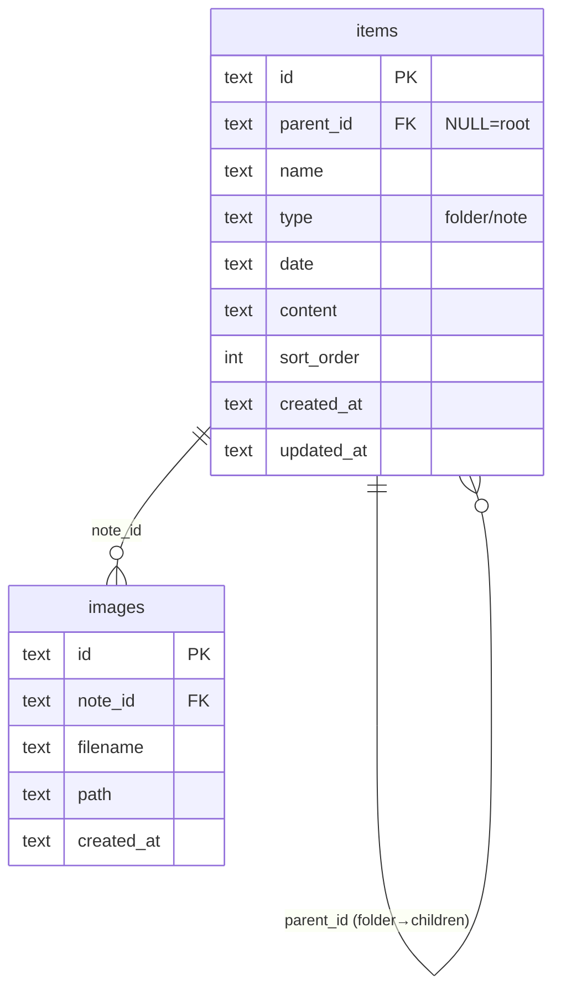
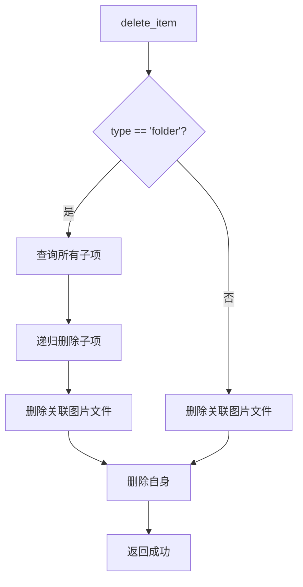

# NoteKeep 模块需求与设计一体化文档

> **文档编号**: MOD-NOTEKEEP-2026-04-24
> **文档版本**: v1.0
> **创建日期**: 2026-04-24
> **文档状态**: 草稿

**评审边界说明**:
- **需求评审**: 第 2 章（需求分析）→ 通过后锁定为需求基线 v1.0
- **设计评审**: 第 3-4 章（技术设计 + 部署运维）→ 通过后锁定设计基线 v1.x
- **交接契约**: 2.5 验收条件 — 需求定义 What，设计实现 How

**ID 体系**: US（用户故事，来自 PRD）、FEAT（功能）、API（接口）、RULE（业务规则/系统约束）、TC（测试用例）、RISK（风险）、NFR（非功能指标）
场景编号：S-（正常）、E-（异常）、B-（边界，按需）

---

## 目录

- [1. 文档控制](#1-文档控制)
  - [1.1 责任人](#11-责任人)
  - [1.2 修订历史](#12-修订历史)
- [2. 需求分析](#2-需求分析)
  - [2.1 需求概述](#21-需求概述-必填)
  - [2.2 痛点与价值](#22-痛点与价值-必填)
  - [2.3 功能方案](#23-功能方案-必填)
  - [2.4 范围与边界](#24-范围与边界-必填)
  - [2.5 验收条件](#25-验收条件-必填)
- [3. 技术设计](#3-技术设计)
  - [3.1 方案选型](#31-方案选型-必填)
  - [3.2 架构设计](#32-架构设计-必填)
  - [3.3 数据设计](#33-数据设计-必填)
  - [3.4 接口设计](#34-接口设计-必填)
  - [3.5 质量实现方案](#35-质量实现方案-必填)
- [4. 部署与运维](#4-部署与运维)
  - [4.1 部署架构](#41-部署架构)
  - [4.4 数据迁移](#44-数据迁移-按需)
- [5. 风险与依赖](#5-风险与依赖)
- [6. 需求追溯矩阵](#6-需求追溯矩阵)
- [附录：术语表](#附录术语表)

---

## 1. 文档控制

### 1.1 责任人

| 角色 | 姓名 | 职责范围 |
|------|------|---------|
| 产品经理 | | 需求定义、业务验收 |
| 开发负责人 | | 技术方案、代码实现 |
| 测试负责人 | | 测试策略、质量保证 |

### 1.2 修订历史

| 版本 | 日期 | 作者 | 变更描述 |
|------|------|------|---------|
| v0.1 | 2026-04-24 | | 初始草稿 |

---

## 2. 需求分析

### 2.1 需求概述 [必填]

| 项目 | 内容 |
|------|------|
| **模块名称** | NoteKeep 跨平台笔记软件 |
| **模块ID** | MOD-NOTEKEEP |
| **所属系统/产品线** | 桌面应用 / 个人效率工具 |
| **需求类型** | 新功能 |
| **业务背景** | 个人笔记需求：现有工具（Notion/Obsidian）太复杂；复制粘贴常带格式；缺少本地优先的 MD 笔记工具 |
| **核心目标** | 打造轻量、跨平台、界面简洁的本地笔记软件，支持 MD 编辑、图片粘贴、日期管理、文件组织 |

---

### 2.2 痛点与价值 [必填]

| 维度 | 内容 |
|------|------|
| **目标用户** | 个人用户（技术/非技术均可），日常记录、写日记、整理思绪 |
| **当前问题** | Notion 复杂付费；复制粘贴带格式；无好用的本地 MD 工具 |
| **业务影响** | 笔记整理效率低；排版混乱导致重复劳动 |
| **预期价值** | 降低笔记整理时间；消除复制粘贴格式问题；提升写作体验 |

**用户故事**

| 编号 | 用户故事 | 优先级 |
|------|---------|--------|
| US-01 | 作为**日记用户**，我希望**按日期快速创建日记**，以便**每天记录生活** | P0 |
| US-02 | 作为**写作者**，我希望**使用顶部工具栏格式化文本**，以便**像 Word 一样排版** | P0 |
| US-03 | 作为**用户**，我希望**粘贴图片直接插入笔记**，以便**记录截图和照片** | P0 |
| US-04 | 作为**整理者**，我希望**创建文件夹和笔记**，以便**分类管理内容** | P0 |
| US-05 | 作为**用户**，我希望**拖拽调整顺序**，以便**自定义排列** | P0 |
| US-06 | 作为**用户**，我希望**全文搜索笔记内容**，以便**快速找到信息** | P0 |
| US-07 | 作为**用户**，我希望**复制粘贴时自动清除格式**，以便**避免排版混乱** | P0 |
| US-08 | 作为**技术用户**，我希望**支持完整 MD 语法**，以便**写技术文档** | P1 |
| US-09 | 作为**用户**，我希望**重命名和删除**文件夹/笔记，以便**管理内容** | P0 |

---

### 2.3 功能方案 [必填]

#### 2.3.1 功能清单

| 功能ID | 功能名称 | 功能描述 | 优先级 | 来源 |
|--------|---------|---------|--------|------|
| FEAT-01 | MD 编辑器 | 基于 TipTap 的富文本编辑器，支持切换编辑/预览/双屏模式，实时渲染 MD 语法 | P0 | US-08 |
| FEAT-02 | 顶部工具栏 | 类 Word 工具栏：字体、字号、加粗、斜体、下划线、删除线、对齐、列表、引用、代码块、插入图片/链接 | P0 | US-02 |
| FEAT-03 | 文件/文件夹管理 | 新建、删除、重命名文件夹和笔记；树形结构展示；记住展开状态 | P0 | US-04, US-09 |
| FEAT-04 | 拖拽排序 | 拖拽调整文件夹/笔记的排列顺序，持久化 sort_order | P0 | US-05 |
| FEAT-05 | 按天日记 | 日历视图，按日期筛选/创建日记 | P0 | US-01 |
| FEAT-06 | 图片粘贴 | 监听剪贴板图片，保存到 `~/.notekeep/data/images/`，MD 中引用相对路径 | P0 | US-03 |
| FEAT-07 | 全文搜索 | SQLite FTS5 搜索标题和内容；顶部搜索框实时搜索（debounce 300ms） | P0 | US-06 |
| FEAT-08 | 纯文本粘贴 | 粘贴时自动清除富文本格式，仅保留纯文本 | P0 | US-07 |
| FEAT-09 | 悬浮目录 | 编辑器右侧悬浮目录导航，显示标题层级（H1-H6），点击跳转；5秒无操作自动隐藏；滚动时自动出现 | P1 | - |

#### 2.3.2 字段约束

**items 表字段约束**

| 字段名 | 字段类型 | 必填 | 约束 | 说明 |
|--------|---------|------|------|------|
| id | TEXT | Y | PK, UUID | 主键 |
| parent_id | TEXT | N | FK(items.id), NULL=根目录 | 父文件夹，NULL 表示根级 |
| name | TEXT | Y | NOT NULL | 文件夹名或笔记标题 |
| type | TEXT | Y | 'folder' 或 'note' | 类型 |
| date | TEXT | N | YYYY-MM-DD 格式 | 日记日期（仅笔记） |
| content | TEXT | N | | MD 内容（仅笔记） |
| sort_order | INTEGER | Y | DEFAULT 0 | 排序序号 |
| created_at | TEXT | Y | 本地时间 | 创建时间，格式 YYYY-MM-DD HH:mm:ss |
| updated_at | TEXT | Y | 本地时间 | 更新时间，格式 YYYY-MM-DD HH:mm:ss |

**images 表字段约束**

| 字段名 | 字段类型 | 必填 | 约束 | 说明 |
|--------|---------|------|------|------|
| id | TEXT | Y | PK, UUID | 主键 |
| note_id | TEXT | Y | FK(items.id) | 所属笔记 |
| filename | TEXT | Y | NOT NULL | 存储文件名 UUID.png |
| path | TEXT | Y | | 相对路径 ./images/xxx.png |
| created_at | TEXT | Y | 本地时间 | 创建时间，格式 YYYY-MM-DD HH:mm:ss |

---

### 2.4 范围与边界 [必填]

| 类别 | 内容 |
|------|------|
| **范围（In Scope）** | 桌面端笔记软件（Tauri + React）；本地 SQLite 存储；MD 编辑器；图片粘贴；文件管理；日历日记；全文搜索；切换编辑/预览/双屏模式；悬浮目录导航 |
| **非范围（Out of Scope）** | 云同步/多设备；移动端；协作功能；插件系统；导出为 PDF/Word |
| **前置假设** | 用户有本地文件系统读写权限；图片单文件 < 10MB；数据目录 `~/.notekeep/` 可迁移 |

---

### 2.5 验收条件 [必填]

#### 2.5.1 业务规则与约束

| ID | 类型 | 描述 |
|----|------|------|
| RULE-01 | 业务规则 | 删除文件夹时递归删除所有子项，弹出确认框 |
| RULE-02 | 业务规则 | 粘贴图片仅支持 PNG/JPG/GIF，单文件 ≤ 10MB |
| RULE-03 | 业务规则 | 笔记内容停止输入 1s 后自动保存（debounce） |
| RULE-04 | 业务规则 | 搜索结果实时显示，debounce 300ms |
| RULE-05 | 系统约束 | 图片存储路径为相对路径 `./images/xxx.png`，支持数据迁移 |
| RULE-06 | 系统约束 | 侧边栏展开状态持久化，启动时恢复 |
| RULE-07 | 系统约束 | 所有时间字段使用本地时间，不使用 UTC |

#### 2.5.2 功能验收场景

**正常场景**

| 场景ID | 功能ID | 优先级 | 前置条件 | 操作步骤 | 预期结果 |
|--------|--------|--------|---------|---------|---------|
| S-01 | FEAT-01 | P0 | 无 | 1. 切换到预览模式<br>2. 切换到双屏模式<br>3. 切换回编辑模式 | 模式正确切换，内容一致 |
| S-02 | FEAT-02 | P0 | 打开笔记 | 1. 选中文字<br>2. 点击加粗按钮 | 文字变为 **加粗** |
| S-03 | FEAT-03 | P0 | 在根目录 | 1. 右键 → 新建文件夹<br>2. 输入名称<br>3. 右键 → 新建笔记 | 文件夹/笔记创建成功 |
| S-04 | FEAT-04 | P0 | 有多个同级项 | 拖拽第一项到最后 | 排序更新且持久化 |
| S-05 | FEAT-05 | P0 | 无 | 1. 点击日历某日期<br>2. 无日记则点击创建 | 跳转当天日记创建 |
| S-06 | FEAT-06 | P0 | 有笔记打开 | 1. Ctrl+V 粘贴截图<br>2. 查看 MD 内容 | 图片保存，引用插入 |
| S-07 | FEAT-07 | P0 | 有笔记 | 1. 顶部搜索框输入关键词<br>2. 等待 300ms | 实时显示匹配结果 |
| S-08 | FEAT-08 | P0 | 有富文本在剪贴板 | 1. Ctrl+V 粘贴 | 仅纯文本内容被粘贴 |

**异常场景**

| 场景ID | 功能ID | 触发条件 | 系统行为 | 用户感知 |
|--------|--------|---------|---------|---------|
| E-01 | FEAT-03 | 删除含子项的文件夹 | 弹出确认框"将删除 X 个子项" | 确认后递归删除 |
| E-02 | FEAT-06 | 粘贴非图片内容 | 正常粘贴文本 | 不触发图片处理 |
| E-03 | FEAT-07 | 搜索无结果 | 显示"未找到相关笔记" | 空状态提示 |
| E-04 | FEAT-06 | 图片文件丢失 | 显示占位符 | 提示"图片不存在" |

#### 2.5.3 非功能指标

**性能指标**

| 指标ID | 指标名称 | 目标值 | 测量方法 |
|--------|---------|-------|---------|
| NFR-PERF-01 | 冷启动时间 | < 2s | 计时 |
| NFR-PERF-02 | 搜索响应 | < 500ms | FTS5 查询计时 |
| NFR-PERF-03 | 自动保存延迟 | 停止输入 1s 后 | 日志验证 |

**可靠性指标**

| 指标ID | 指标名称 | 目标值 |
|--------|---------|-------|
| NFR-REL-01 | 数据持久化 | 100% 不丢数据 |

**安全性要求**

| 指标ID | 安全域 | 验收标准 |
|--------|--------|---------|
| NFR-SEC-01 | 数据安全 | 数据本地存储，无网络传输 |

**兼容性要求**

| 指标ID | 平台 | 验收标准 |
|--------|------|---------|
| NFR-COMPAT-01 | Windows | Windows 10+ |
| NFR-COMPAT-02 | macOS | macOS 10.15+ |
| NFR-COMPAT-03 | Linux | Ubuntu 20.04+ / Debian 11+ |

---

## 3. 技术设计

### 3.1 方案选型 [必填]

#### 技术栈

| 类别 | 选型 | 版本 | 选型理由 |
|------|------|------|---------|
| 语言 | Rust | 1.75+ | 系统级语言，Tauri 核心，性能优秀 |
| 桌面框架 | Tauri | 2.x | 轻量级跨平台（WebView），插件生态完整 |
| 前端框架 | React | 18.x | 组件化生态成熟 |
| 前端构建 | Vite | 5.x | 快速开发热更新 |
| 富文本编辑器 | TipTap | 2.x | ProseMirror 封装，扩展丰富，支持 MD |
| 数据库 | SQLite + FTS5 | 3.x | 本地存储，全文搜索成熟方案 |
| ORM | rusqlite | 0.31.x | SQLite Rust 绑定 |
| 拖拽 | @dnd-kit | 6.x | React 拖拽库，支持排序 |
| 日历 | react-day-picker | 8.x | 轻量日历组件 |
| 日期处理 | date-fns | 3.x | 轻量日期库 |

---

### 3.2 架构设计 [必填]

```
┌─────────────────────────────────────────────────────────────┐
│                    Web Frontend (React)                      │
│  ┌─────────┐ ┌─────────┐ ┌─────────┐ ┌─────────────────┐  │
│  │ Toolbar │ │ Sidebar │ │ Editor  │ │   Search Bar    │  │
│  └────┬────┘ └────┬────┘ └────┬────┘ └────────┬────────┘  │
│       └───────────┴────────────┴───────────────┘           │
│                           │                                  │
│                    Tauri IPC (invoke)                        │
└───────────────────────────┼─────────────────────────────────┘
                            │
┌───────────────────────────▼─────────────────────────────────┐
│                    Tauri Rust Backend                         │
│  ┌─────────────────────────────────────────────────────┐    │
│  │                   Command Handlers                    │    │
│  │  create_item / get_item / update_item / delete_item │    │
│  │  move_item / reorder_items / search_items            │    │
│  │  save_image / get_image                              │    │
│  └──────────────────────┬──────────────────────────────┘    │
│  ┌──────────────────────▼──────────────────────────────┐    │
│  │                    Database (SQLite)                 │    │
│  │     items (id, parent_id, name, type, date,         │    │
│  │             content, sort_order, created_at, updated_at) │  │
│  │     items_fts (FTS5 virtual table)                  │    │
│  │     images (id, note_id, filename, path, created_at)│    │
│  └─────────────────────────────────────────────────────┘    │
│  ┌─────────────────────────────────────────────────────┐    │
│  │               File System (~/.notekeep/)             │    │
│  │     data/notekeep.db   data/images/xxx.png          │    │
│  └─────────────────────────────────────────────────────┘    │
└─────────────────────────────────────────────────────────────┘
```

#### 技术分层

| 层级 | 职责 | 文件 |
|------|------|------|
| Frontend | UI 渲染、用户交互、状态管理 | React components |
| Tauri Commands | 接收前端请求、参数校验、调用 Service | src-tauri/src/commands.rs |
| Service | 业务逻辑、数据验证 | src-tauri/src/service.rs |
| Repository | 数据库操作（CRUD、FTS） | src-tauri/src/db.rs |
| FS | 图片存储管理 | src-tauri/src/image.rs |

---

### 3.3 数据设计 [必填]

**表: items**

| 字段名 | 类型 | 可空 | 默认值 | 索引 | 说明 |
|--------|------|------|--------|------|------|
| id | TEXT | N | | PK | UUID |
| parent_id | TEXT | Y | NULL | INDEX | 父文件夹，NULL=根 |
| name | TEXT | N | | | 名称 |
| type | TEXT | N | | | 'folder' 或 'note' |
| date | TEXT | Y | NULL | INDEX | YYYY-MM-DD |
| content | TEXT | Y | '' | | MD 内容 |
| sort_order | INTEGER | N | 0 | INDEX | 排序 |
| created_at | TEXT | N | | | 本地时间 YYYY-MM-DD HH:mm:ss |
| updated_at | TEXT | N | | | 本地时间 YYYY-MM-DD HH:mm:ss |

**索引设计**

| 索引名 | 类型 | 字段 | 使用场景 |
|--------|------|------|---------|
| idx_items_parent | INDEX | parent_id | 查询子项 |
| idx_items_date | INDEX | date | 按日期筛选日记 |
| idx_items_sort | INDEX | parent_id, sort_order | 排序查询 |

**FTS5 虚拟表: items_fts**

| 字段 | 来源 |
|------|------|
| name | items.name |
| content | items.content |

**表: images**

| 字段名 | 类型 | 可空 | 默认值 | 索引 | 说明 |
|--------|------|------|--------|------|------|
| id | TEXT | N | | PK | UUID |
| note_id | TEXT | N | | INDEX, FK | 所属笔记 |
| filename | TEXT | N | | | UUID.png |
| path | TEXT | N | | | ./images/xxx.png |
| created_at | TEXT | N | | | 本地时间 YYYY-MM-DD HH:mm:ss |

**ER 图**



---

### 3.4 接口设计 [必填]

#### 接口清单

| 接口ID | 名称 | 方法 | 路径 | 详细 |
|--------|------|------|------|------|
| CMD-01 | create_item | invoke | item:create | [↓](#cmd-01-create_item) |
| CMD-02 | get_item | invoke | item:get | [↓](#cmd-02-get_item) |
| CMD-03 | update_item | invoke | item:update | [↓](#cmd-03-update_item) |
| CMD-04 | delete_item | invoke | item:delete | [↓](#cmd-04-delete_item) |
| CMD-05 | move_item | invoke | item:move | [↓](#cmd-05-move_item) |
| CMD-06 | reorder_items | invoke | item:reorder | [↓](#cmd-06-reorder_items) |
| CMD-07 | list_items | invoke | item:list | [↓](#cmd-07-list_items) |
| CMD-08 | search_items | invoke | item:search | [↓](#cmd-08-search_items) |
| CMD-09 | save_image | invoke | image:save | [↓](#cmd-09-save_image) |
| CMD-10 | get_image | invoke | image:get | [↓](#cmd-10-get_image) |

---

#### CMD-01: create_item

**请求**

| 参数 | 类型 | 必填 | 说明 |
|------|------|------|------|
| parent_id | string | N | 父文件夹 ID，NULL 表示根目录 |
| name | string | Y | 文件夹名或笔记标题 |
| type | string | Y | 'folder' 或 'note' |
| date | string | N | YYYY-MM-DD（仅 note） |

**请求示例**

```json
{
  "parent_id": null,
  "name": "我的日记",
  "type": "folder"
}
```

**响应**

| 参数 | 类型 | 说明 |
|------|------|------|
| code | int | 0=成功 |
| data | object | 创建的 item |
| message | string | 错误信息 |

**响应示例**

```json
{
  "code": 0,
  "message": "success",
  "data": {
    "id": "uuid-xxx",
    "parent_id": null,
    "name": "我的日记",
    "type": "folder",
    "date": null,
    "content": "",
    "sort_order": 0,
    "created_at": "2026-04-24 10:00:00",
    "updated_at": "2026-04-24 10:00:00"
  }
}
```

---

#### CMD-02: get_item

**请求**

| 参数 | 类型 | 必填 | 说明 |
|------|------|------|------|
| id | string | Y | item ID |

**响应**: 返回 item 对象

---

#### CMD-03: update_item

**请求**

| 参数 | 类型 | 必填 | 说明 |
|------|------|------|------|
| id | string | Y | item ID |
| name | string | N | 新名称（重命名） |
| content | string | N | 新内容（编辑笔记） |
| date | string | N | 新日期 |

**请求示例**

```json
{
  "id": "uuid-xxx",
  "name": "新标题"
}
```

---

#### CMD-04: delete_item

**请求**

| 参数 | 类型 | 必填 | 说明 |
|------|------|------|------|
| id | string | Y | item ID |

**处理逻辑**



---

#### CMD-05: move_item

**请求**

| 参数 | 类型 | 必填 | 说明 |
|------|------|------|------|
| id | string | Y | item ID |
| new_parent_id | string | Y | 新父文件夹 ID，NULL 表示移到根 |

---

#### CMD-06: reorder_items

**请求**

| 参数 | 类型 | 必填 | 说明 |
|------|------|------|------|
| items | array | Y | [{id, sort_order}] 排序后的 ID 和顺序 |

**请求示例**

```json
{
  "items": [
    {"id": "uuid-1", "sort_order": 0},
    {"id": "uuid-2", "sort_order": 1},
    {"id": "uuid-3", "sort_order": 2}
  ]
}
```

---

#### CMD-07: list_items

**请求**

| 参数 | 类型 | 必填 | 说明 |
|------|------|------|------|
| parent_id | string | N | 父文件夹 ID，NULL 表示根目录 |
| type | string | N | 过滤类型 'folder' 或 'note' |
| date | string | N | YYYY-MM-DD，筛选当天日记 |

**响应**: 返回 item 数组，按 sort_order 排序

---

#### CMD-08: search_items

**请求**

| 参数 | 类型 | 必填 | 说明 |
|------|------|------|------|
| query | string | Y | 搜索关键词 |
| date_from | string | N | 开始日期 |
| date_to | string | N | 结束日期 |

**响应**: 返回匹配的 item 数组，含高亮片段

---

#### CMD-09: save_image

**请求**

| 参数 | 类型 | 必填 | 说明 |
|------|------|------|------|
| note_id | string | Y | 所属笔记 ID |
| image_data | string | Y | Base64 编码的图片数据 |
| mime_type | string | Y | image/png, image/jpeg, image/gif |

**响应**

| 参数 | 类型 | 说明 |
|------|------|------|
| data.path | string | 相对路径 ./images/uuid.png |

---

#### CMD-10: get_image

**请求**

| 参数 | 类型 | 必填 | 说明 |
|------|------|------|------|
| id | string | Y | image ID |

**响应**: 返回图片的 Base64 数据

---

### 3.5 质量实现方案 [必填]

#### 性能设计

| 指标ID | 目标值 | 实现方案 |
|--------|-------|---------|
| NFR-PERF-01 | < 2s 冷启动 | Tauri 原生渲染，无 electron 打包开销 |
| NFR-PERF-02 | < 500ms 搜索 | SQLite FTS5 索引，LIMIT 限制 |
| NFR-PERF-03 | 1s debounce 保存 | 前端 debounce，停止输入后 1s 调用 save |

#### 可靠性设计

| 场景 | 实现方案 |
|------|---------|
| 数据持久化 | SQLite 事务，保存失败重试 1 次 |
| 图片保存失败 | 返回错误，前端提示用户重试 |

#### 安全性设计

| 指标ID | 验收标准 | 实现方案 |
|--------|---------|---------|
| NFR-SEC-01 | 数据本地存储 | 无网络请求，所有数据存本地 |
| - | 图片路径校验 | 仅允许 ./images/ 相对路径，防止路径遍历 |

---

## 4. 部署与运维

### 4.1 部署架构

| 环境 | 产物 | 说明 |
|------|------|------|
| dev | `cargo tauri dev` | 开发调试 |
| build | `cargo tauri build` | 生成安装包 |

**安装包**

| 平台 | 格式 | 说明 |
|------|------|------|
| Windows | .msi / .exe | NSIS 安装器 |
| macOS | .dmg | Apple Disk Image |
| Linux | .AppImage / .deb | 通用包 |

### 4.4 数据迁移

| 阶段 | 操作 | 验证方法 |
|------|------|---------|
| 迁移 | 复制整个 `~/.notekeep/` 目录 | 新电脑启动正常 |
| 图片路径 | 数据库内存储相对路径 `./images/` | 无论搬到哪里都能找到 |

---

## 5. 风险与依赖

### 5.1 项目依赖

| 依赖模块 | 依赖内容 | 状态 | 风险等级 |
|---------|---------|------|---------|
| Tauri 2.x | 桌面框架 | 稳定 | 低 |
| TipTap | 富文本编辑器 | 稳定 | 低 |
| rusqlite | SQLite ORM | 稳定 | 低 |

### 5.2 风险识别

| 风险ID | 类型 | 描述 | 概率 | 影响 | 应对措施 |
|--------|------|------|------|------|---------|
| RISK-01 | 性能 | 大图片积累占用磁盘 | 中 | 低 | 未来加图片压缩 |
| RISK-02 | 兼容性 | WebView 依赖 | 低 | 中 | Tauri 2.x 内置 WebView2 |

---

## 6. 需求追溯矩阵

| 用户故事 | 功能ID | 接口ID | 测试用例ID | 状态 |
|---------|--------|--------|-----------|------|
| US-01 | FEAT-05 | CMD-01, CMD-07 | TC-05 | ✅ |
| US-02 | FEAT-02 | - | TC-02 | ✅ |
| US-03 | FEAT-06 | CMD-09, CMD-10 | TC-06 | ✅ |
| US-04 | FEAT-03 | CMD-01, CMD-03, CMD-04 | TC-03 | ✅ |
| US-05 | FEAT-04 | CMD-06 | TC-04 | ✅ |
| US-06 | FEAT-07 | CMD-08 | TC-07 | ✅ |
| US-07 | FEAT-08 | - | TC-08 | ✅ |
| US-08 | FEAT-01 | CMD-03 | TC-01 | ✅ |
| US-09 | FEAT-03 | CMD-03, CMD-04 | TC-09 | ✅ |

---

## 附录：术语表

| 术语 | 定义 |
|------|------|
| US | User Story，用户故事（来自 PRD） |
| FEAT | Feature，功能项 |
| API | Application Programming Interface，接口 |
| RULE | 业务规则或系统约束 |
| TC | Test Case，测试用例 |
| RISK | 风险项 |
| NFR | Non-Functional Requirement，非功能性需求 |
| AC | Acceptance Criteria，验收条件 |
| ADR | Architecture Decision Record，架构决策记录 |
| FTS5 | Full-Text Search 5，SQLite 的全文搜索扩展 |
| MD | Markdown，轻量级标记语言 |
| PRD | Product Requirements Document，产品需求文档 |

---

*文档结束*